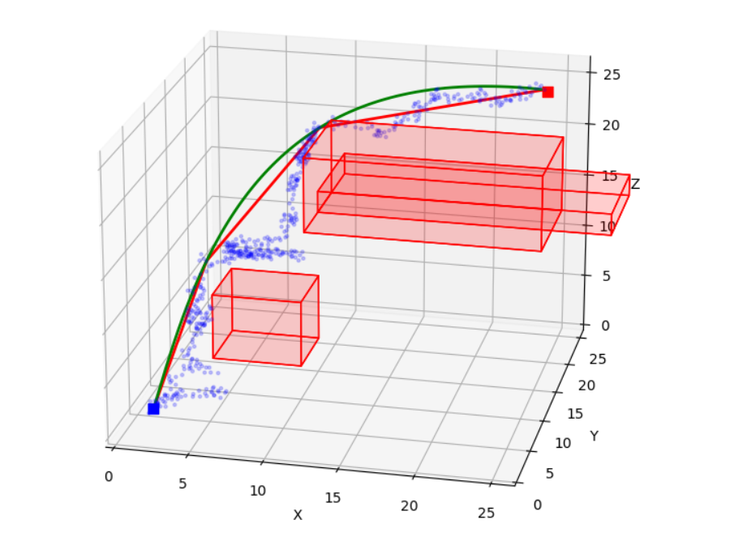

# Path Planning with Dynamics Constraints for Fixed Wing Drones
## RRT* and Dubin Curves

This repository contains a work in progress project focused on developing a trajectory planner for fixed wing drones, considering their dynamics constraints.

Rapidly-exploring Random Trees (RRT*) is an advanced motion planning algorithm that provides efficient and asymptotically optimal solutions. It incrementally builds a tree structure while seeking to connect random samples in the search space, allowing for quick exploration.

Dubin Curves are a set of continuous, smooth curves used for planning paths between two points in the plane while maintaining a minimum turning radius constraint, making them well-suited for fixed wing drone path planning.

## Examples

This plot is generated by running `rrt_star_example.py`. Note that due to randomness, the result may vary.

 

